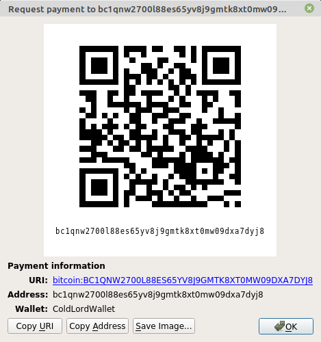

# Donation details

## Our status:

Now, we're just creating projects that will help us in the implementation of our big plan.  
Now, we're just making the name. Our purpose is to provide safety for people and organizations that will be public, EASY for 
understanding, OPEN for developers and SECURE for everyone.  
Now, we're just starting working on our plan and creating standards that will help people being sure in their data's safety.  
Now, if you're reading this, be sure, we will be №1 provider of security in the future.  
The most of our work is doing offline and now we're having a lack of work power, but we're aimed at our goals and we are moving towards the goal step by step, commit by commit. And sooner or later, we will reach our goals.  

## Donation status:

If you like Red projects and interested in their improvements you can help us.

At this page are presented donation details of Red.

Thank you for your assistance in the development of Red.

## Donation details:

Bitcoin (₿): bc1qnw2700l88es65yv8j9gmtk8xt0mw09dxa7dyj8

