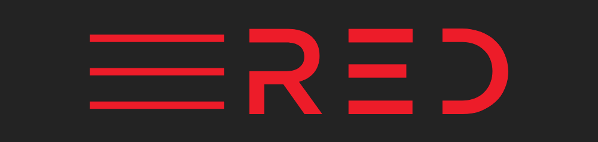

# 💸 Donation details (تفاصيل التبرع)

## Our status:

Now, we're just creating projects that will help us in the implementation of our _BIG PLAN_.  
Now, we're just making the _name_. Our _purpose_ is to _provide safety_ for people and organizations that will be _public_,   

-_**EASY (.سهل)**_- to understand, 
-_**OPEN (.افتح)**_- for developers and 
-_**SECURE (.يؤمن)**_- for everyone.  

Now, we're just starting working on our plan and _creating standards_ that will _help people_ being sure in their _data's safety_.  
Now, if you're reading this, be sure, we will be _#1 provider of security_ in the future.  
The most of our work is doing _offline_ and now we're having a lack of work power, but we're aimed at our goals and we are moving towards them _step by step_, commit by commit. And sooner or later, _we will reach our goals_.  

## Donation status:

If you like _Red_ projects and interested in their improvements you can _help us_.

At this page are presented donation details of _Red_.

Thank you for your assistance in the development of _Red_.  

## Donation details:

_Bitcoin (₿)_: bc1qnw2700l88es65yv8j9gmtk8xt0mw09dxa7dyj8

